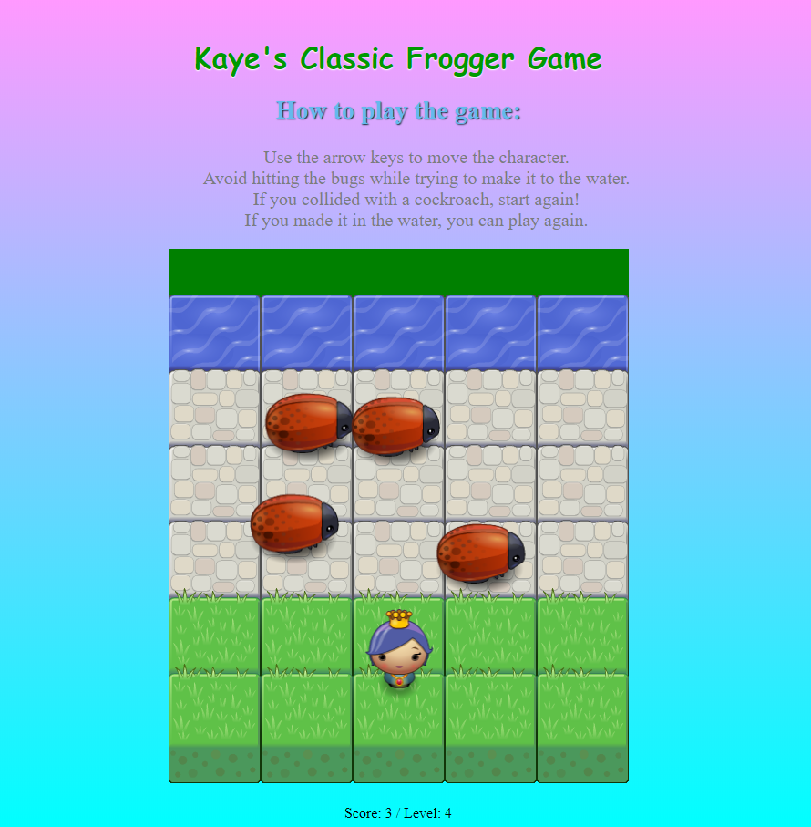

<h1> Classic Arcade Game -GWG Udacity- </h1>

<h2> How to Play the Game </h2>
<ul>
	<li> Use arrow keys to move the player.</li>
	<li> The objective is to reach the water.</li>
	<li> If the player collided with the bug, the game restarts.</li>
	<li> Each time the player reaches the water, difficulty increases.</li>
	<li> Click <a href="https://kayezhie.github.io/Arcade-Game/">here</a> to play the game.</li>
	<li> Lastly, Enjoy!!!</li>
</ul>

<h2> Screenshot </h2>

<h2> Resources I referred to: </h2>

 All of this resources/webinars are given by Udacity's Mentor, Coach, and Student Leader. Big Thank You to them! 

<ul>
	<li><a href="http://udacity.github.io/frontend-nanodegree-styleguide/javascript.html">
	http://udacity.github.io/frontend-nanodegree-styleguide/javascript.html</a></li>
	<li>
	https://matthewcranford.com/feed-reader-walkthrough-part-1-starter-code/</li>
	<li>
	https://www.youtube.com/watch?v=JcQYGbg0IkQ</li>
	<li>
	https://www.youtube.com/watch?v=0ovAyu3ZvFQ</li>
	<li>
	https://www.youtube.com/watch?v=7PHhRrjgTDA</li>
</ul>